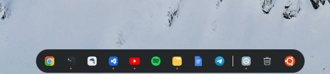

### BUG IN MY LAPTOP
- Download theme from <b>https://www.gnome-look.org/p/1681451</b><br>
- I'am using Ubuntu 22.04.


By default css `gnome-shell/gnome-shell.css`

```css
.dash-background {
  background-color: rgba(29, 32, 33, 0.95);
  margin-bottom: 16px;
  padding: 10px;
  border-radius: 40px;
  box-shadow: inset 0 0 0 1px rgba(249, 245, 215, 0.03);
}
```

Fix css `gnome-shell/gnome-shell.css`

```css
#dash {
  margin-top: 2px;
  margin-bottom: 2px;
  padding: 0px;
}

.dash-background {
  background-color: rgba(104, 97, 97, 0);
  margin-bottom: 0px;
  margin-top: 0px;
  padding: 2px;
  border: none;
  justify-items: center;
  border-radius: 20px;
  box-shadow: inset 0 0 0 1px #f9f5d700;
}
```
And finally

